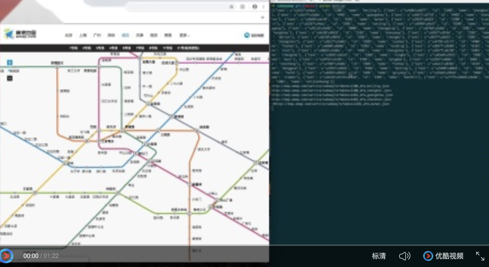

## 目录

* [高德地铁图抓取](./subwaymap/main.py "悬停显示")

### 1. 高德地铁图抓取

#### 抓取视频

[](http://player.youku.com/embed/XNDAxNTM3Njk5Mg== "Video Title")

#### 项目总览


#### 使用方法

```
cd subwaymap
# check上图的准备工作后，直接运行
python main.py 
# 生成的地铁图文件在data目录下
```

